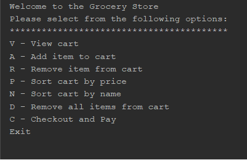
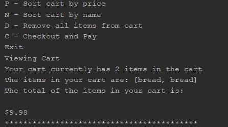
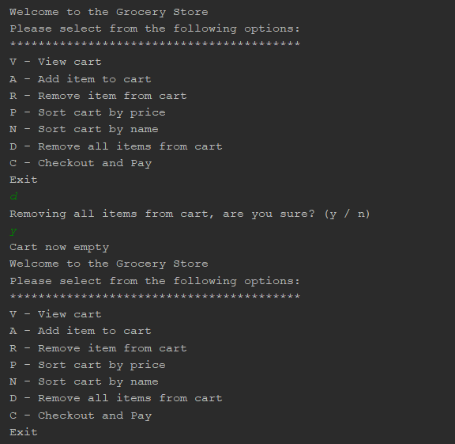

# GroceryStore Engineering Exercise
A Java application to allow the user to utilize a basic shopping cart for a grocery store in Java

Table of contents
=================

  * [Table of contents](#table-of-contents)
  * [Project Info](#project-info)
    * [Documentation](#documentation)
  * [Installation](#installation)
  * [Specifications](#specifications)
  * [Known Bugs](#known-bugs)
  * [Contributing](#contributing)
  * [License](#license)

### Project Info

  Repository for Information about GroceryStore project for Sitka Technology Group Engineering Exercise.

  Requirements were as follows:

  "The Grocery Store"
  
  1. Non-Functional Requirements:
  * Console or terminal application in a language of your choosing.
  2. Functional Requirements:
  * Display menu of available commands.
  * Allow input of "grocery product" into a cart.
  * Grocery products have these attributes:
    * Name, Unit of Measure, Quantity, Price
  * Allow listing products in cart.
    * This should show a subtotal per line (quantity * price)
    * User should be allowed to sort by Name or subtotal.
  * Support adding and removing items in cart.
  * Support clearing cart.
  * Support checkout.
    * Devise a way to present payment methods and input information appropriate to the selected method.

### Documentation

  Navigating the application should be fairly straight forward.  When first run, and after each selection, the main menu will display.
  The user will be given options to select and will then navigate to the option itself for more input.
  Some of the options are currently not yet implemented in order to get the project minimally completed in a timely manner.

## Setup/Installation Requirements

* Clone the repo
* Open in your favorite editor
* Run App and view in Java console

## Specifications

| Behavior      | Example Input         | Example Output        |
| ------------- | ------------- | ------------- |
| display menu of available commands  | user starts app  | menu displayed  |
| allow input of 'grocery product' in to a cart  | user adds item to cart | You have added 5 milk to your cart   |
| allow listing products in cart  | user selects "View cart" | Items in cart and price listed |
| allow sorting in cart by name  | user sorts by name | cart items sorted a-z   |
| allow for removal of item from cart  | user selects remove item from cart  | prompt for what items and quantity to be deleted   |
| allow for clearing all items from cart  | user selects "remove all items from cart" | Cart Empty   |
| allow for checkout with a payment method with associated input  |  | Not Yet Implemented   |

## Known Bugs
* Contact Rich Garrick at <richmgarrick@gmail.com>

## Contributing

1. Fork it!
2. Create your feature branch: `git checkout -b my-new-feature`
3. Commit your changes: `git commit -am 'Add some feature'`
4. Push to the branch: `git push origin my-new-feature`
5. Submit a pull request :D

## Future Features

*   Ascii receipt
*   Admin 'dashboard' to allow adding/editing/deleting new products for store

## License
The MIT License (MIT)
Copyright 2018 Rich Garrick
