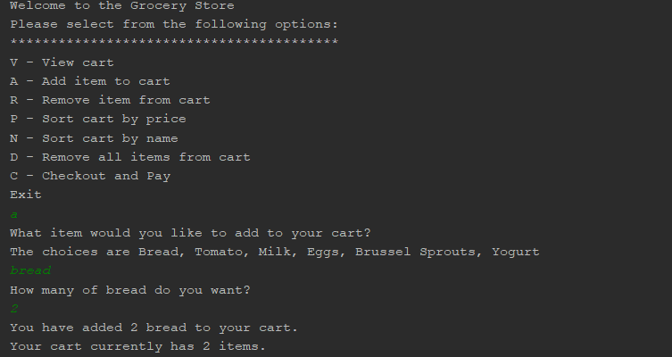

# GroceryStore Engineering Exercise
A Java application to allow the user to utilize a basic shopping cart for a grocery store in Java

Table of contents
=================

  * [Table of contents](#table-of-contents)
  * [Project Info](#project-info)
    * [Documentation](#documentation)
  * [Installation](#installation)
  * [Specifications](#specifications)
  * [Known Bugs](#known-bugs)
  * [Contributing](#contributing)
  * [License](#license)

### Project Info

  Repository for Information about GroceryStore

### Documentation

  No documentation for this exists yet.

## Setup/Installation Requirements

* Clone the repo
* Open in your favorite editor
* Run App and view in Java console

## Specifications

| Behavior      | Example Input         | Example Output        |
| ------------- | ------------- | ------------- |
| display menu of available commands  | user starts app  | menu displayed  |
| allow input of 'grocery product' in to a cart  | user adds item to cart | You have added 5 milk to your cart   |
| allow listing products in cart  | user selects "View cart" | Items in cart and price listed |
| allow sorting in cart by name or price  |  | Not Yet Implemented   |
| allow for removal of item from cart  |  | Not Yet Implemented   |
| allow for clearing all items from cart  | user selects "remove all items from cart" | Cart Empty   |
| allow for checkout with a payment method with associated input  |  | Not Yet Implemented   |

## Known Bugs
* Contact Rich Garrick at <richmgarrick@gmail.com>

## Contributing

1. Fork it!
2. Create your feature branch: `git checkout -b my-new-feature`
3. Commit your changes: `git commit -am 'Add some feature'`
4. Push to the branch: `git push origin my-new-feature`
5. Submit a pull request :D

## Future Features

*   Ascii receipt
*   Admin 'dashboard' to allow adding/editing/deleting new products for store

## License
The MIT License (MIT)
Copyright 2018 Rich Garrick
